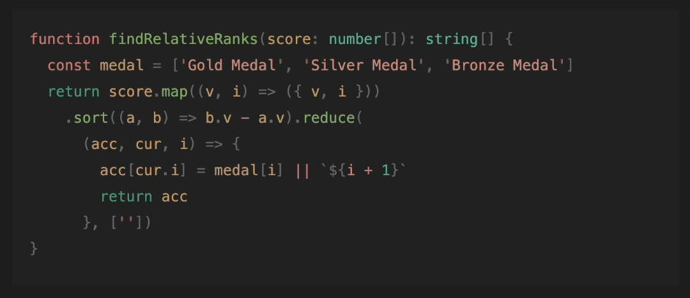

# markdown-it-copy-code

[![npm version][npm-version-src]][npm-version-href]
[![License][license-src]][license-href]

Support copy code to clipboard for markdown-it.

## Features

Using native javascript to copy code to clipboard so that we don't need to the compatibility of libraries like [clipboard.js](https://clipboardjs.com/).



## Usage

We supply plugin, style and script for you to use.

### Install
``` sh
npm i markdown-it-copy-code
```

### Options
``` ts
import MarkdownIt from 'markdown-it'
import MarkdownItCopyCode from 'markdown-it-copy-code'

const md = new MarkdownIt()
md.use(MarkdownItCopyCode, {
  // if you want use default config, just ignore options below.
  // below shows default options
  containerClass: 'markdown-copy-code-container',
  buttonClass: 'markdown-copy-code-button',
  codeSVGClass: 'markdown-copy-code-code',
  doneSVGClass: 'markdown-copy-code-done',
  // default is hugeicons:task-01
  codeSVG: '<svg>...</svg>',
  // default is hugeicons:task-done-01
  doneSVG: '<svg>...</svg>',
})
```

### Script
You should run this script in your html file.
As an example, you can run it after mounting components in Vue.
``` vue
<script setup lang="ts">
import { useCopyCode } from 'markdown-it-copy-code'
import { onMounted } from 'vue'

onMounted(() => {
  useCopyCode()
})
</script>
```

### Style

We supply three styles for you to use.
You can choose one of them based on your preference.

``` ts
// no matter which style you choose, you should import base.css first
import 'markdown-it-copy-code/styles/base.css'
// choose one of the following styles
import 'markdown-it-copy-code/styles/large.css'
// import 'markdown-it-copy-code/styles/medium.css'
// import 'markdown-it-copy-code/styles/small.css'
```

You can also customize the style by yourself based on `className` you set in options.
See [large.css](./styles/large.css) for reference.

<!-- Badges -->

[npm-version-src]: https://img.shields.io/npm/v/markdown-it-copy-code
[npm-version-href]: https://npmjs.com/package/markdown-it-copy-code
[license-src]: https://img.shields.io/github/license/howcasperwhat/markdown-it-copy-code.svg
[license-href]: https://github.com/howcasperwhat/markdown-it-copy-code/blob/main/LICENSE
